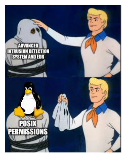

# TP1 : Hardening basics

Dans ce TP on va (re)voir plusieurs aspects qu'il est élémentaire de considérer avant d'aller vers un renforcement plus en profondeur.

On va donc toucher à plusieurs aspects du système, de l'OS, et effectuer des configurations augmentant le niveau de sécurité global de la machine.

Toutes les modifications apportées iront dans le même sens : appliquer **[le principe du moindre privilège](https://fr.wikipedia.org/wiki/Principe_de_moindre_privil%C3%A8ge)** (least privilege principle).

> C'est un principe connu en informatique, et qui est toujours bénéfique : chaque entité (chaque programme, chaque user, chaque fichier, etc.) ne doit avoir que les droits strictement minimaux pour faire ce qu'elle a besoin. Pas la moindre permission supplémentaire.



Au menu donc, on revoit des aspects élémentaires de l'administration d'un système Linux, mais en appliquant une configuration forte qui respecte le principe du moindre privilège :

- **gestion d'utilisateurs**
  - users, identité
  - escalation de privilège : `sudo` et polkit
- **revue des permissions**
  - permissions POSIX
  - attributs étendus
- **réseau**
  - maîtrise exhaustive des programmes en écoute
  - firewall
- **stockage et partitions**
  - options de montage
- **services**
  - configuration robuste de openSSH server

Les parties seront toutes analogues dans leur déroulé :

- observation de l'existant
- configurationn pour améliorer le niveau de sécurité

# Sommaire


# Prérequis

➜ **Une machine virtuelle prête à l'emploi**

- **avec un OS Rocky Linux**
  - on est plutôt orientés serveur dans ce cours, donc sans GUI évidemment 
  - n'oubliez pas de vous créer un utilisateur à l'installation
- **réseau**
  - doit avoir un accès internet normal (NAT dans VBox)
  - doit avoir un accès à un LAN dans lequel se trouve votre PC (host-only dans VBox)
  - vous oubliez les cartes en bridge, sinon c'est pas la peine de venir à ce cours
- **administration de la machine**
  - connexion SSH fonctionnelle à la machine
  - vous n'utilisez pas `root` directement, sinon c'est pas la peine de venir à ce cours

> Pas `root` directement, ça veut dire que vous vous connectez avec un utilisateur qui porte votre nom, voter pseudo, peu importe (vous l'avez normalement créé lors de l'installation de l'OS). Si vous avez besoin d'accéder aux permissions de `root`, vous utiliserez la commande `sudo`.

➜ **Compte-rendu format Markdown**

- sur un dépôt git dédié
- ne contient que des commandes (pas de screens)
- les commandes sont toujours au plus précis
- par exemple, si je vous demande d'afficher la liste des programmes Python lancés :

```bash
# cette commande liste TOUS les processus de la machines
# donc techniquement, elle répond à la question
ps -ef

# on préférera cela dit une ligne de commande plus développée
# qui met en évidence uniquement les informations pertinentes pour la question :
ps -ef | grep python
```

# Suite du TP

➜ [**Part I** : User management](./part1.md)

➜ [**Part II** : Files and permissions](./part2.md)

➜ [**Part III** : Networking](./part3.md)

➜ [**Part IV** : Storage and partitions](./part4.md)

➜ [**Part V** : OpenSSH Server](./part5.md)

