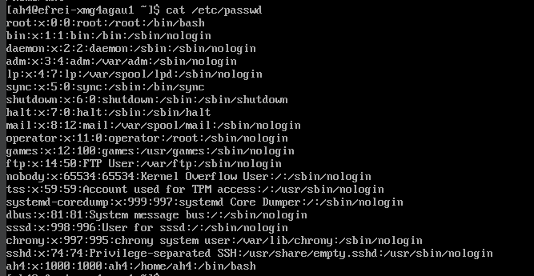
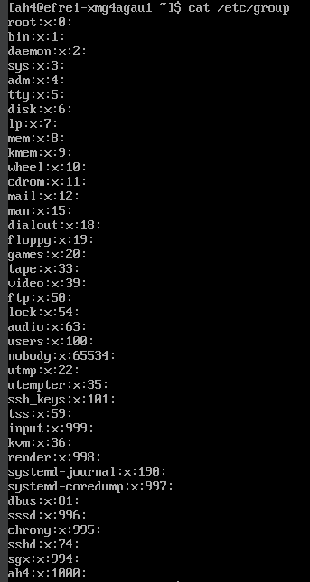
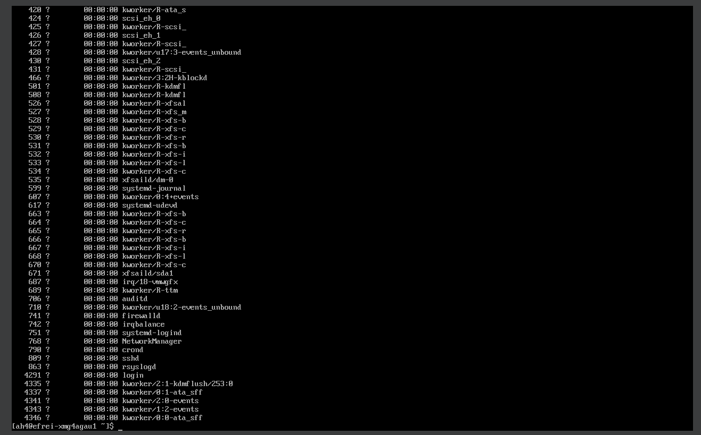
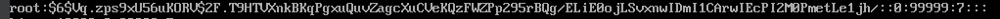
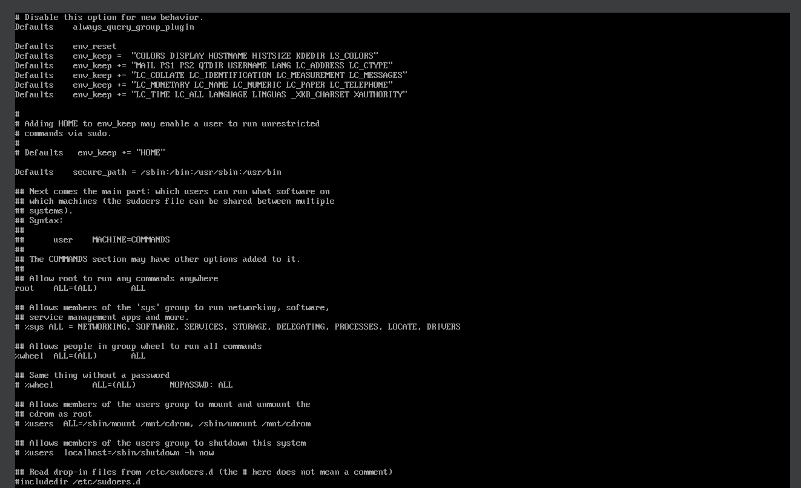

# Part I : User management

## 🌞 Déterminer l'existant :

Les utilisateurs créés sur la machine sont:
```
cat /etc/passwd
```


Les groupes d'utilisateurs sont:
```
cat /etc/group
```


Mon utilisateur (ah4) se trouve dans:
```
groups
```
seulement: **ah4**

---

## 🌞 Lister tous les processus qui sont actuellement en cours d'exécution, lancés par root

Les processus lancés par root sont:
```
ps -u root
```


---

## 🌞 Lister tous les processus qui sont actuellement en cours d'exécution, lancés par votre utilisateur

Les processus lancés par l'utilisateur sont:
```
ps -u
```


---

## 🌞 Déterminer le hash du mot de passe de root

Il faut se connecter en tant que root via la commande
```
su
```
ensuite afficher `/etc/shadow` via la commande `cat` par exemple


## 🌞 Déterminer le hash du mot de passe de votre mot de passe

Même procédé qu'avant.

## 🌞 Déterminer la fonction de hachage qui a été utilisée

Le format du mot de passe est de ce type la:
```
$id$salt$hash
```
Sachant que l'ID est 6, on sait qu'il correspond à la fonction SHA512

## 🌞 Déterminer, pour l'utilisateur root :

### son shell par défaut:

Il faut faire `su` puis `echo $SHELL` ou il est directement affiché dans /etc/passwd

-> **/bin/bash**


### le chemin vers son répertoire personnel

Il est affiché à côté de l'utilisateur depuis le `/etc/passwd`, on peut le récupérer avec la commande `grep "^root" /etc/passwd`

## 🌞 Déterminer, pour l'utilisateur pour votre utilisateur :

### son shell par défaut:

Il faut faire `echo $SHELL`

-> **/bin/bash**

### le chemin vers son répertoire personnel

Il est affiché à côté de l'utilisateur depuis le `/etc/passwd`, on peut le récupérer avec la commande `grep "^ah4" /etc/passwd`

-> **/home**

## 🌞 Afficher la ligne de configuration du fichier sudoers qui permet à votre utilisateur d'utiliser sudo

`cat /etc/sudoers`




# 2. User creation and configuration

## 🌞 Créer un utilisateur :
En tant que root:

- doit s'appeler `meow`
- ne doit appartenir QUE à un groupe nommé `admins`
- ne doit pas avoir de répertoire personnel utilisable
- ne doit pas avoir un shell utilisable

```
useradd -g admins meow
```

> Il s'agit donc ici d'un utilisateur avec lequel on pourra pas se connecter à la machine (ni en console, ni en SSH).

## 🌞 Configuration `sudoers`

- ajouter une configuration `sudoers` pour que l'utilisateur `meow` puisse exécuter seulement et uniquement les commandes `ls`, `cat`, `less` et `more` en tant que votre utilisateur

Il faut localiser les programmes ls, cat, less et more
```
whereis ls -> /usr/bin/ls
whereis cat -> /usr/bin/cat
whereis more -> /usr/bin/more
whereis less -> /usr/bin/less
```

Pour se faire, il faut créer un nouveau fichier dans le dossier `/etc/sudoers.d` et écrire dedans:
```
ah4 ALL=(meow) /usr/bin/ls, /usr/bin/cat, /usr/bin/less, /usr/bin/more
```

- ajouter une configuration `sudoers` pour que les membres du groupe `admins` puisse exécuter seulement et uniquement la commande `dnf` en tant que `root`

```
%admins ALL=(root) /usr/bin/dnf
```

- ajouter une configuration `sudoers` pour que votre utilisateur puisse exécuter n'importe quel commande en tant `root`, sans avoir besoin de saisir un mot de passe
```
ah4 ALL=(root) NOPASSWD: ALL
```

- prouvez que ces 3 configurations ont pris effet (vous devez vous authentifier avec le bon utilisateur, et faire une commande `sudo` qui doit fonctioner correctement)
```
sudo -u meow ls /
-> Autorisé

sudo -u meow cat /
-> Autorisé

sudo -u meow more /
-> Autorisé

sudo -u meow less /
-> Autorisé

sudo -u echo ""
-> Non autorisé

su meow
sudo dnf
-> Autorisé

sudo cat /etc/shadow
-> Autorisé
```

> Pour chaque point précédent, c'est une seule ligne de configuration à ajouter dans le fichier `sudoers` de la machine.

## 3. Hackers gonna hack

## 🌞 Déjà une configuration faible ?

- l'utilisateur `meow` est en réalité complètement `root` sur la machine hein là. Prouvez-le.

Depuis meow je peux executer less depuis l'utilisateur ah4 qui lui même peut executer root sans password et avec l'élevation de privilège
```
sudo -u ah4 less /etc/passwd
!/bin/sh
```

- proposez une configuration similaire, sans présenter cette faiblesse de configuration
  - vous pouvez ajouter de la configuration
  - ou supprimer de la configuration
  - du moment qu'on garde des fonctionnalités à peu près équivalentes !
