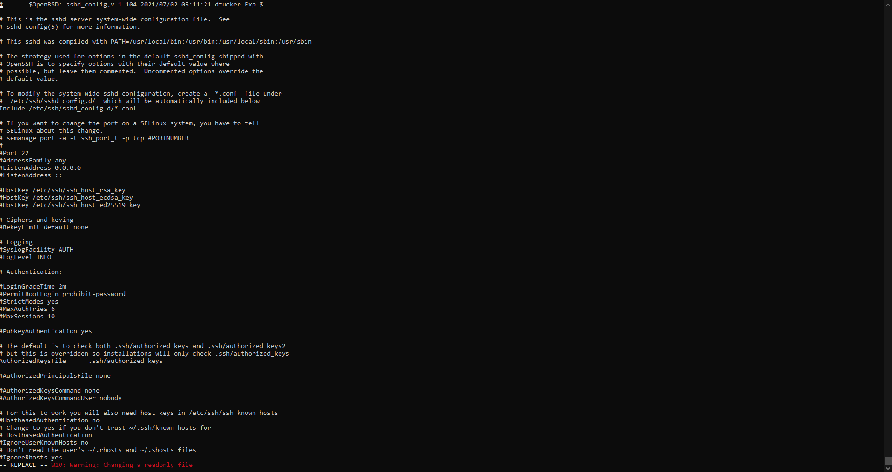
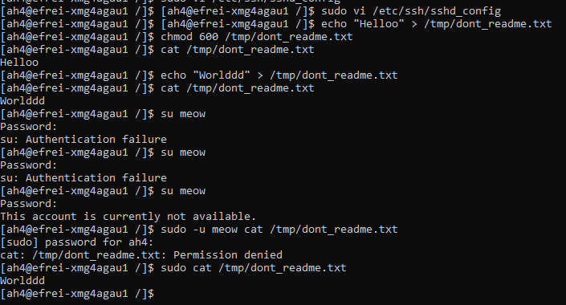

# Part II : Files and permissions

**Dans un OS, en particulier Linux, on dit souvent que "tout est fichier".**

En effet, que ce soit les programmes (que ce soit `ls`, ou Firefox, ou Steam, ou le kernel), les fichiers personnels, les fichiers de configuration, et bien d'autres, **l'ensemble des composants d'un OS, et tout ce qu'on peut y ajouter se résume à un gros tas de fichiers.**

Gérer correctement les permissions des fichiers est une étape essentielle dans le renforcement d'une machine.

**C'est la première barrière de sécurité, (beaucoup) trop souvent négligée, alors qu'elle est extrêmement efficace et robuste.**

## 1. Listing POSIX permissions

🌞 **Déterminer les permissions des fichiers/dossiers...**

- le fichier qui contient la liste des utilisateurs
- le fichier qui contient la liste des hashes des mots de passe des utilisateurs
- le fichier de configuration du serveur OpenSSH
- le répertoire personnel de l'utilisateur `root`
- le répertoire personnel de votre utilisateur
- le programme `ls`
- le programme `systemctl`

```bash
ls /etc/passwd
ls /etc/shadow
ls /etc/ssh/sshd_config
ls /root
ls ~

whereis ls
whereis systemctl
ls /usr/bin/ls
ls /usr/bin/systemctl
```

> POSIX c'est le nom d'un standard qui regroupe plein de concepts avec lesquels vous êtes finalement déjà familiers. Les permissions rwx qu'on retrouve sous les OS Linux (et MacOS, et BSD, et d'autres) font partie de ce standard et sont donc appelées "permissions POSIX".


## 2. Extended attributes

🌞 **Lister tous les programmes qui ont le bit SUID activé**

```bash
sudo find / -type f -perm -4000
```

🌞 **Rendre le fichier de configuration du serveur OpenSSH immuable**

- ça se fait avec les attributs étendus
- "immuable" ça veut dire qu'il ne peut plus être modifié DU TOUT : il est donc en read-only
- prouvez que le fichier ne peut plus être modifié

```bash
sudo chattr +i /etc/ssh/sshd_config
```



## 3. Protect a file using permissions

🌞 **Restreindre l'accès à un fichier personnel**

- créer un fichier nommé `dont_readme.txt` (avec le contenu de votre choix)
- il doit se trouver dans un dossier lisible et écrivable par tout le monde
- faites en sorte que seul votre utilisateur (pas votre groupe) puisse lire ou modifier ce fichier
- personne ne doit pouvoir l'exécuter
- prouvez que :
  - votre utilisateur peut le lire
  - votre utilisateur peut le modifier
  - l'utilisateur `meow` ne peut pas y toucher
  - l'utilisateur `root` peut quand même y toucher

> C'est l'un des "superpouvoirs" de `root` : contourner les permissions POSIX (les permissions `rwx`). On verra bien assez tôt que `root` n'a pas de "superpouvoirs" mais que ces contournements sont liés à une mécanique qu'on appelle les *capabilites*. C'est pour plus tard ! :)
>

```bash
echo "Hello, world!" > /tmp/dont_readme.txt
chmod 600 /tmp/dont_readme.txt
```

