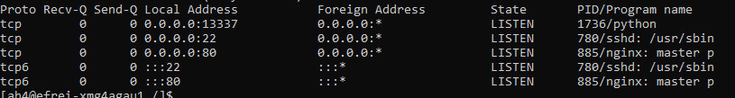
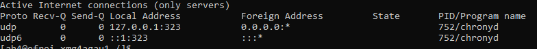
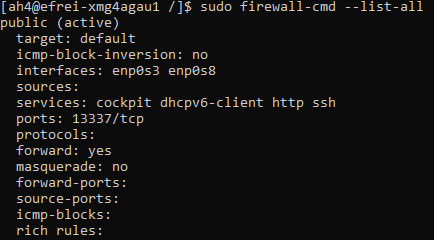

# Part III : Networking

Le réseau c'est la porte d'entrée pour toutes les autres machines. C'est le seul moyen d'être attaqué à distance.

Maîtriser au mieux le réseau d'une machine est donc primordial pour prétendre en renforcer la sécurité.

## 1. Listening ports

🌞 **Déterminer la liste des programmes qui écoutent sur port TCP**

```bash
sudo netstat -tlnp
```



t: TCP
l: listening
n: numeric
p: process

🌞 **Déterminer la liste des programmes qui écoutent sur port UDP**

```bash
sudo netstat -ulnp
```



u: UDP

## 2. Firewalling

🌞 **Pour chacun des ports précédemment repérés...**

- montrez qu'il existe une règle firewall qui autorise le trafic entrant sur ce port
- ou pas ?

```bash
sudo firewall-cmd --list-all
```



🌞 **Fermez tous les ports inutilement ouverts dans le firewall**

- principe du moindre privilège encore et encore !
- pas besoin qu'un port soit ouvert si aucun service n'écoute dessus

```bash
# remplacer ... par les ports à fermer
sudo firewall-cmd --remove-port=...
```

🌞 **Pour toutes les applications qui sont en écoute sur TOUTES les adresses IP**

- dans Linux, ce sont les applications qui écoutent sur la pseudo-adresse IP `0.0.0.0` : ça signifie que toutes les adresses IP de la machine sont concernées
- modifier la configuration de l'application pour n'écouter que une seule IP : celle qui est nécessaire

```bash
firewall-cmd --zone=public --add-rich-rule='rule family="ipv4" source address="0.0.0.0" drop'
```


