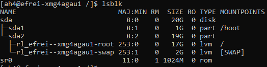
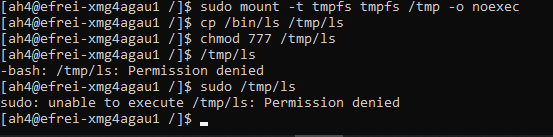

# Part IV : Storage and partitions

Les fichiers, c'est bien beau, mais faut bien des partitions pour les stocker !

**Cette partie est dédiée aux partitions**, quelques subtilités autour, et on en profite pour parler des **options de montage**.

## 1. Existing partitions

🌞 **Déterminer la liste des partitions du système**

- on dit aussi la liste des partitions qui sont actuellement "montées"

```bash
lsblk
```



🌞 **Identifier la partition qui est montée sur `/`**

- la partition est identifiée par un chemin dans `/dev`

La partition montée sur `/` est `/dev/sda2/rl_efrei--xmg4agau1-root`

## 2. Mount options

🌞 **Déterminer les options de montage de la partition `/`**

- expliquer chaque option de montage configurées pour `/`

```bash
mount | grep /dev/sda2
```

🌞 **Monter une partition de type `tmpfs` sur le dossier `/tmp`**

- il doit être impossible de lancer un programme s'il est stocké sur cette partition
  - ça se fait en spécifiant une option de montage
- prouvez que la modification est effective :
  - je veux voir une copie d'une programme existant dans `/tmp`
  - puis une commande pour lui mettre les full droits pour tout le monde : `777` (ou `rwxrwxrwx`)
  - preuve que votre utilisateur ne peut pas l'exécuter

```bash
sudo mount -t tmpfs tmpfs /tmp -o noexec

# copie du programme
cp /bin/ls /tmp/ls
chmod 777 /tmp/ls
```



> La partition montée sur `/tmp` a une place un peu particulière, pour plusieurs raisons. Déjà, le type de la partition, sur les systèmes Linux modernes, c'est du **`tmpfs`** (c'est stocké en RAM directement). Autre chose : ce dossier est habituellement en 777 car tout le monde/toutes les applications doivent pouvoir créer ds fichiers temporaires si c'est nécessaire pour leur bon fonctionnement. C'est donc le répertoire de prédilection des vilains hackers quand ils ont besoin de télécharger leur ptit malware par exemple.

