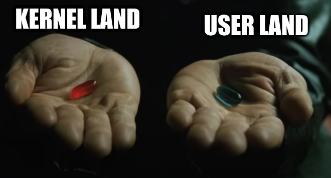

# TP2 : Syscalls

Dans ce TP on va revoir un peu quelques notions autour des programmes et des processus, et on va vite surtout se concentrer sur la notion de *syscall* (ou "appel système" en français).

**Un *syscall* est une fonction mise à disposition de tous les programmes, par le kernel.**

Ces fonctions permettent d'interagir avec le système, pour par exemple créer un fichier.

Une autre façon de le dire, c'est que si un programme veut créer un fichier (par exemple), il est **obligé** d'appeler un *syscall*.

> Pour ceux qui ont déjà fait un peu de C, la librairie `stdio.h`, contenue dans la Glibc permet d'appeler des *syscalls*.

**Voir les *syscalls* qu'appelle un programme, c'est surveiller son comportement.**

## Sommaire

- [TP2 : Syscalls](#tp2--syscalls)
  - [Sommaire](#sommaire)
- [0. Prérequis](#0-prérequis)
- [Suite du TP](#suite-du-tp)

# 0. Prérequis

➜ **Une machine virtuelle prête à l'emploi**

- **avec un OS de votre choix**
  - Rocky c'est bien
  - n'oubliez pas de vous créer un utilisateur à l'installation
- **réseau**
  - doit avoir un accès internet normal (NAT dans VBox)
  - doit avoir un accès à un LAN dans lequel se trouve votre PC (host-only dans VBox)
  - vous oubliez les cartes en bridge, sinon c'est pas la peine de venir à ce cours
- **administration de la machine**
  - connexion SSH fonctionnelle à la machine
  - vous n'utilisez pas `root` directement, sinon c'est pas la peine de venir à ce cours

> Pas `root` directement, ça veut dire que vous vous connectez avec un utilisateur qui porte votre nom, voter pseudo, peu importe (vous l'avez normalement créé lors de l'installation de l'OS). Si vous avez besoin d'accéder aux permissions de `root`, vous utiliserez la commande `sudo`.

➜ **Compte-rendu format Markdown**

# Suite du TP

➜ [**Part I** : Learn](./part1.md)

➜ [**Part II** : Observe](./part2.md)

➜ [**Part III** : Service Hardening](./part3.md)

➜ [**Part IV** : My shitty app](./part4.md)
