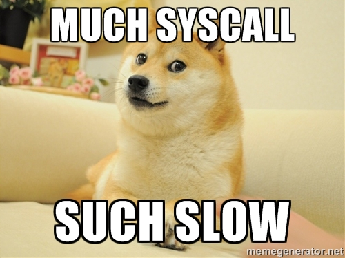

# Part II : Observe

**Il est possible d'observer en temps réel ce que fait un programme. On dit qu'on peut *tracer* un programme.**

Plusieurs techniques pour faire ça, suivant ce qu'on veut voir ; dans ce TP on va se concentrer sur les *syscalls*.

L'outil le plus élémentaire à connaître est `strace`. Il s'utilise en terminal et affiche tous les *syscalls*  que réalisent un processus.

On va aussi utiliser `sysdig` plus moderne et plus puissant.

## Sommaire

- [Part II : Observe](#part-ii--observe)
  - [Sommaire](#sommaire)
  - [1. strace](#1-strace)
  - [2. sysdig](#2-sysdig)
    - [A. Intro](#a-intro)
    - [B. Use it](#b-use-it)
  - [3. Bonus : Stratoshark](#3-bonus--stratoshark)

## 1. strace

Si on veut tracer un processus avec `strace`, c'est comme ça :

```bash
# pour tracer l'exécution d'un echo par exemple
$ strace echo yo
```

🌞 **Utiliser `strace` pour tracer l'exécution de la commande `ls`**

- faites `ls` sur un dossier qui contient des trucs
- mettez en évidence le *syscall* pour écrire dans le terminal le résultat du `ls`

C'est **write**:
```
strace ls /tmp

write(1, "systemd-private-9f7d83722d904c6c"..., 72systemd-private-9f7d83722d904c6c8ffc9a5fdd38d54f-chronyd.service-rp2q7J
) = 72
write(1, "systemd-private-9f7d83722d904c6c"..., 76systemd-private-9f7d83722d904c6c8ffc9a5fdd38d54f-dbus-broker.service-rsDfsO
) = 76
write(1, "systemd-private-9f7d83722d904c6c"..., 75systemd-private-9f7d83722d904c6c8ffc9a5fdd38d54f-irqbalance.service-rsLIy5
) = 75
write(1, "systemd-private-9f7d83722d904c6c"..., 70systemd-private-9f7d83722d904c6c8ffc9a5fdd38d54f-kdump.service-uazyCj
) = 70
write(1, "systemd-private-9f7d83722d904c6c"..., 79systemd-private-9f7d83722d904c6c8ffc9a5fdd38d54f-systemd-logind.service-DvygWC
) = 79
write(1, "who.mp3\n", 8who.mp3
) = 8
```

🌞 **Utiliser `strace` pour tracer l'exécution de la commande `cat`**

- faites `cat` sur un fichier qui contient des trucs

`strace cat /tmp/test.txt`
- mettez en évidence le *syscall* qui demande l'ouverture du fichier en lecture

`openat(AT_FDCWD, "test.txt", O_RDONLY)  = 3`
- mettez en évidence le *syscall* qui écrit le contenu du fichier dans le terminal

`write(1, "Hello I'm just a \\n file cd /tmp"..., 34Hello I'm just a \n file cd /tmp!)`

🌞 **Utiliser `strace` pour tracer l'exécution de `curl example.org`**

- vous devez utiliser une option de `strace`
- elle affiche juste un tableau qui liste tous les *syscalls*  appelés par la commande tracée, et combien de fois ils ont été appelé

```
strace -c curl example.org

% time     seconds  usecs/call     calls    errors syscall
------ ----------- ----------- --------- --------- ----------------
 24.55    0.004481          31       141           mmap
 13.20    0.002409          40        60        14 openat
  8.01    0.001462        1462         1           execve
  7.09    0.001295          23        54           close
  6.70    0.001223          26        46           fstat
  6.46    0.001179          53        22           futex
  6.41    0.001171          33        35           mprotect
  6.06    0.001107          30        36           read
  4.32    0.000789          14        56           rt_sigaction
  3.57    0.000651          34        19           poll
  2.98    0.000544         544         1           sendto
  2.69    0.000491         245         2           socket
  0.68    0.000125          31         4           brk
  0.64    0.000116          58         2           newfstatat
  0.60    0.000110          18         6           fcntl
  0.57    0.000104         104         1         1 connect
  0.56    0.000102          25         4           pread64
  0.53    0.000096          32         3           write
  0.44    0.000080          40         2           socketpair
  0.41    0.000075          75         1           clone3
  0.41    0.000074          24         3           rt_sigprocmask
  0.36    0.000065          32         2           statfs
  0.35    0.000064          32         2         1 access
  0.32    0.000058          29         2           ioctl
  0.28    0.000052          26         2         1 arch_prctl
  0.28    0.000052          26         2           getdents64
  0.21    0.000039          19         2           recvfrom
  0.20    0.000037          37         1           munmap
  0.19    0.000035          35         1           pipe
  0.14    0.000026          26         1           sysinfo
  0.14    0.000026          26         1           set_tid_address
  0.14    0.000026          26         1           getrandom
  0.14    0.000025          25         1           prlimit64
  0.14    0.000025          25         1           rseq
  0.13    0.000024          24         1           set_robust_list
  0.03    0.000006           1         4           setsockopt
  0.03    0.000005           5         1           getsockopt
  0.02    0.000004           4         1           getpeername
  0.02    0.000003           3         1           getsockname
------ ----------- ----------- --------- --------- ----------------
100.00    0.018256          34       526        17 total
```

## 2. sysdig

### A. Intro

`sysdig` est un outil qui permet de faire pleiiin de trucs, et notamment tracer les *syscalls*  que le kernel reçoit.

Si on le lance sans préciser, il affichera TOUS les *syscalls*  que reçoit votre kernel.

On peut ajouter des filtres, pour ne voir que les *syscalls*  qui nous intéressent.

Par exemple :

```bash
# si on veut tracer les *syscalls*  effectués par le programme echo
sysdig proc.name=echo
```

> Il existe des tonnes et des tonnes de champs utilisables pour les filtres, on peut consulter la liste avec `sysdig -l`.

Ensuite on le laisse tourner, et si un *syscall* est appelé et que ça matche notre filtre, il s'affichera !

### B. Use it

🌞 **Utiliser `sysdig` pour tracer les *syscalls*  effectués par `ls`**

- faites `ls` sur un dossier qui contient des trucs (pas un dossier vide)
- mettez en évidence le *syscall* pour écrire dans le terminal le résultat du `ls`

```bash
sysdig proc.name=ls

# Dans un autre terminal
ls

41985 16:24:46.724168034 3 ls (6485.6485) > rt_sigaction
41986 16:24:46.724168188 3 ls (6485.6485) < rt_sigaction
41987 16:24:46.724169156 3 ls (6485.6485) > fstat fd=1(<f>/dev/tty1)
41988 16:24:46.724170641 3 ls (6485.6485) < fstat res=0
41989 16:24:46.724170961 3 ls (6485.6485) > ioctl fd=1(<f>/dev/tty1) request=5401 argument=7FFF8D2697C0
41990 16:24:46.724171974 3 ls (6485.6485) < ioctl res=0
41991 16:24:46.724179710 3 ls (6485.6485) > write fd=1(<f>/dev/tty1) size=41
41992 16:24:46.724208182 3 ls (6485.6485) < write res=41 data=.[0m.[01;31msysdig-0.39.0-x86_64.rpm.[0m.
41993 16:24:46.724209965 3 ls (6485.6485) > rt_sigaction
41994 16:24:46.724210320 3 ls (6485.6485) < rt_sigaction
41995 16:24:46.724210600 3 ls (6485.6485) > rt_sigaction
41996 16:24:46.724210793 3 ls (6485.6485) < rt_sigaction
41997 16:24:46.724211046 3 ls (6485.6485) > rt_sigaction
```

> Vous pouvez isoler à la main les lignes intéressantes : copier/coller de la commande, et des seule(s) ligne(s) que je vous demande de repérer.

🌞 **Utiliser `sysdig` pour tracer les *syscalls*  effectués par `cat`**

- faites `cat` sur un fichier qui contient des trucs
- mettez en évidence le *syscall* qui demande l'ouverture du fichier en lecture
- mettez en évidence le *syscall* qui écrit le contenu du fichier dans le terminal

```bash
sysdig proc.name=cat

# Dans un autre terminal
cat /tmp/test.txt

# La ligne qui lit le fichier
3080 16:28:45.803523116 3 cat (6504.6504) > read fd=3(<f>/tmp/test.txt) size=131072

# Pour écrire le contenu
3085 16:28:45.805162572 3 cat (6504.6504) < write res=34 data=Hello I'm just a \n file cd /tmp!.
```

🌞 **Utiliser `sysdig` pour tracer les *syscalls*  effectués par votre utilisateur**

- ça va bourriner sec, vu que vous êtes connectés en SSH étou
- juste pour vous éduquer un peu + à ce que fait le kernel à chaque seconde qui passe
- donner la commande pour ça, pas besoin de me mettre le résultat :d

`sysdig user.name=ah4`



🌞 **Livrez le fichier `curl.scap` dans le dépôt git de rendu**

- `sysdig` permet d'enregistrer ce qu'il capture dans un fichier pour analyse ultérieure
- l'extension c'est `.scap` par convention
- **capturez les *syscalls*  effectués par un `curl example.org`**

`sysdig proc.name=curl -w out.scap`

> `sysdig` est un outil moderne qui sert de base à toute la suite d'outils de la boîte du même nom. On pense par exemple à Falco qui permet de tracer, monitorer, lever des alertes sur des *syscalls* , au sein d'un cluster Kubernetes.

## 3. Bonus : Stratoshark

Un tout nouveau tool bien stylé : [Stratoshark](https://wiki.wireshark.org/Stratoshark). L'interface de Wireshark (et ses fonctionnalités de fou) mais pour visualiser des captures de *syscalls*  (et autres).

Vous prenez pas trop la tête avec ça, mais si vous voulez vous amuser avec une interface stylée, il est là !

Vous pouvez exporter une capture `sysdig` avec `sysdig -w meo.scap proc.name=echo` par exemple, et la lire dans Stratoshark. 
