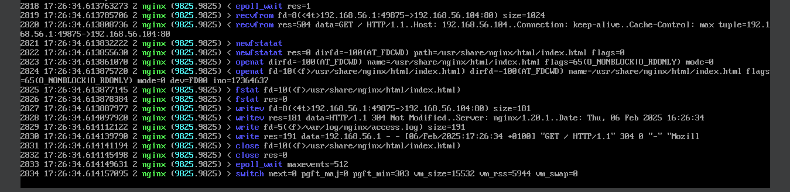

# Part III : Service Hardening

➜ **OK OK OK OK BON. Vous voyez où on va ? Filtrage de *syscalls* !**

Grâce à la partie précédente, vous avez appris à *tracer* un programme : regarder tous les *syscalls* qu'il appelle pendant son fonctionnement.

**Si on sait quels *syscalls* appelle un programme dans son fonctionnement normal, on peut donc dire qu'il n'a pas besoin des autres ! On va voir comment empêcher un programme de passer certains *syscalls*.**

> Genre un appel à `execve("/bin/bash")`, ne cherche pas plus loin, si c'est pas spécifiquement prévu, **c'est un hack**.

Par exemple, on rappelle qu'un appel à un syscall est **rigoureusement nécessaire** si un programme veut :

- lire/écrire dans un fichier
- exécuter un nouveau programme
- utiliser le réseau
- changer des permissions
- et bien d'autres

**Autrement dit, surveiller les sycalls que passe un programme, c'est surveiller ce qu'il demande au système et c'est avoir une vue très fine sur des comportements potentiellements anormaux.**

➜ **Le mécanisme du kernel Linux qui permet de filter les *syscalls*  que fait un programme s'appelle `seccomp`.**

On utilise donc un profil `seccomp` pour filtrer ce qu'a le droit de faire un processus ou non.

Chaque processus lancé peut être lancé avec une whitelist des *syscalls* qu'il a le droit d'appeler.

Tout autre appel sera bloqué.

➜ **On va utiliser le classique serveur Web NGINX dans cette partie comme exemple !**

Un bon cas d'école, et loin d'être inutile tellement NGINX est partout aujourd'hui :)

➜ Avec **systemd** (le gestionnaire de services de Linux), **il est aisé d'appliquer un profil `seccomp` à un service.**

En ajoutant une clause `SystemCallFilter=` à la définition du service, on peut lister les *syscalls* qu'un service aura le droit d'effectuer.


## 1. Install NGINX

➜ **Installer et démarrer le serveur Web NGINX sur la machine**

- le paquet s'appelle `nginx` sous Rocky
- démarrer le service, ouvrez le port firewall, visitez le site web
- assurez-vous que ça marche correctement quoi
- **puis stoppez le service**

➜ **Visualiser la définition du service NGINX**

- chaque service Linux est défini dans un fichier `.service`
- vous pouvez afficher le chemin et le contenu du fichier associé à un service avec `systemctl cat` :

```bash
sudo systemctl cat nginx

[Unit]
Description=The nginx HTTP and reverse proxy server
After=network-online.target remote-fs.target nss-lookup.target
Wants=network-online.target

[Service]
Type=forking
PIDFile=/run/nginx.pid
# Nginx will fail to start if /run/nginx.pid already exists but has the wrong
# SELinux context. This might happen when running `nginx -t` from the cmdline.
# https://bugzilla.redhat.com/show_bug.cgi?id=1268621
ExecStartPre=/usr/bin/rm -f /run/nginx.pid
ExecStartPre=/usr/sbin/nginx -t
ExecStart=/usr/sbin/nginx
ExecReload=/usr/sbin/nginx -s reload
KillSignal=SIGQUIT
TimeoutStopSec=5
KillMode=mixed
PrivateTmp=true

[Install]
WantedBy=multi-user.target
```

> Soyez attentif un peu à son contenu, il faudra écrire par vous-mêmes un service à la partie suivante. Il sera bon de s'inspirer de celui-ci !

➜ **La ligne la plus importante du fichier, c'est celle qui commence par `ExecStart=`**.

- c'est la commande qui est lancée quand vous faites un `sudo systemctl start nginx`
- **autrement dit, lancer cette commande à la main, c'est lancer le programme NGINX à la main**, sans passer par le service
- pourquoi faire ça ? Well...

## 2. NGINX Tracing

🌞 **Tracer l'exécution du programme NGINX**

- lancer NGINX à la main, et utilisez `strace` ou `sysdig` pour voir tous les appels systèmes qu'il effectue
- visitez la page web d'accueil pendant que vous tracez l'exécution, pour voir les *syscalls*  nécessaires lors d'un fonctionnement normal
- dans le compte-rendu, listez tous les *syscalls*  passés par NGINX



## 3. NGINX Hardening

🌞 **HARDEN**

- modifier le fichier `nginx.service` pour inclure un filtrage des *syscalls*
- principe du moindre privilège : vous n'autorisez que le strict nécessaire
- vous me remettez le fichier `nginx.service` modifié dans le compte-rendu naturellement !

```
[Unit]
Description=The nginx HTTP and reverse proxy server
After=network-online.target remote-fs.target nss-lookup.target
Wants=network-online.target

[Service]
Type=forking
PIDFile=/run/nginx.pid
# Nginx will fail to start if /run/nginx.pid already exists but has the wrong
# SELinux context. This might happen when running `nginx -t` from the cmdline.
# https://bugzilla.redhat.com/show_bug.cgi?id=1268621
ExecStartPre=/usr/bin/rm -f /run/nginx.pid
ExecStartPre=/usr/sbin/nginx -t
ExecStart=/usr/sbin/nginx
ExecReload=/usr/sbin/nginx -s reload
KillSignal=SIGQUIT
TimeoutStopSec=5
KillMode=mixed
PrivateTmp=true
SystemCallFilter=epoll_wait,recvfrom,newfstatat,openat,fstat,writev,write,close,switch,close

[Install]
WantedBy=multi-user.target
```