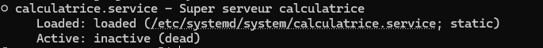
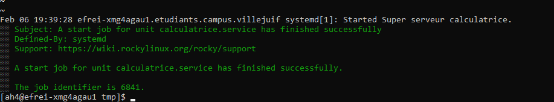
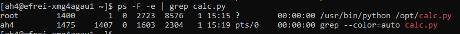
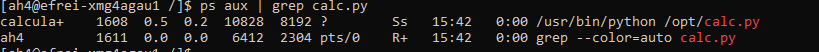
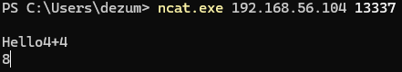
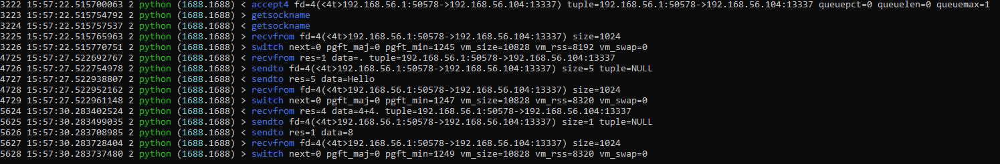
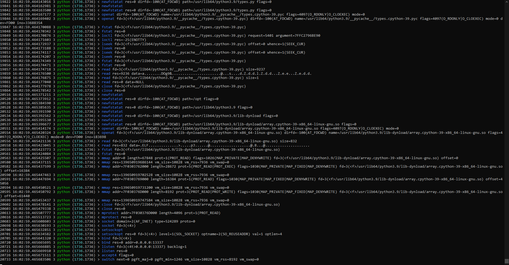
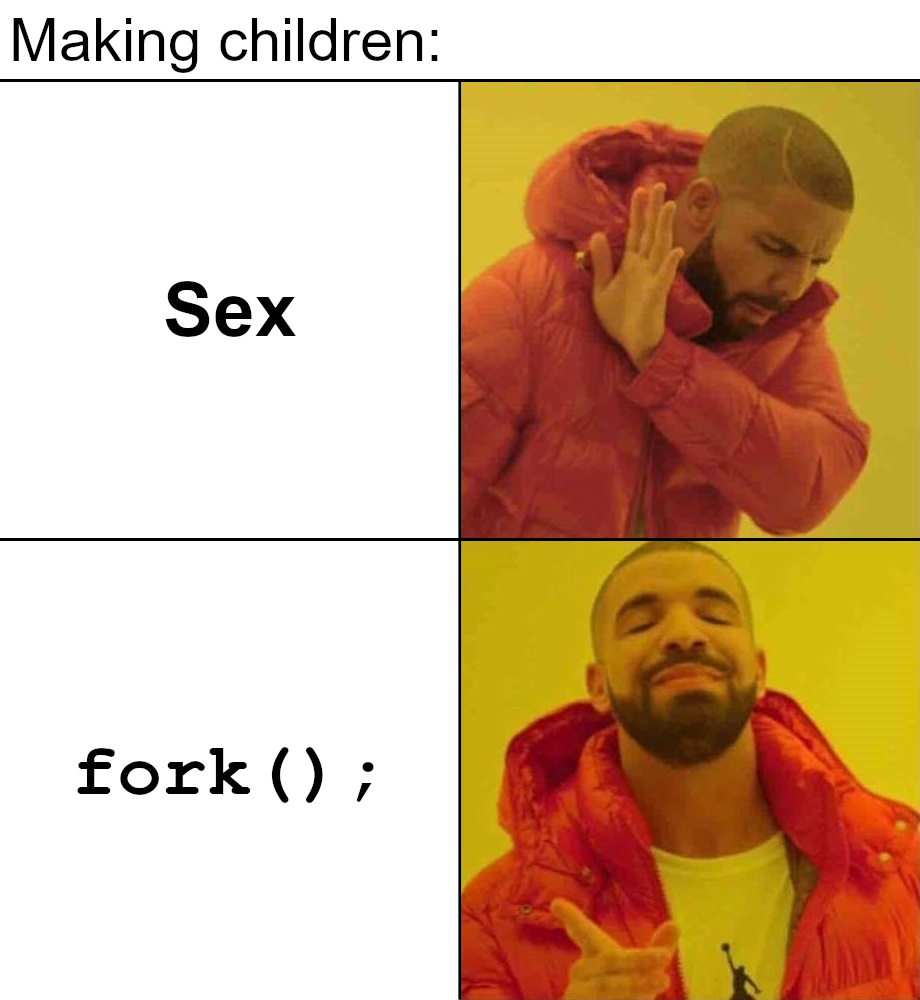

# Part IV : My shitty app

**Je vous file [une application Python (toute pourrie) codée avec mes mains](./calc.py) :**

- elle écoute sur un port TCP
- un client peut se connecter (genre avec `nc`)
- le client peut soumettre une opération arithmétique
- l'application calcule le résultat et l'envoie au client
- l'application se termine

> J'ai dév un truc vite fait, j'trouve ça cool d'avoir un truc simpliste de quelques lignes, facilement compréhensible !


➜ **Le but de cette partie va être de :**

- prendre la maîtrise sur l'application `calc.py`, en la lançant à la main
- l'utiliser, s'y connecter en tant que client
- créer un service `calculatrice.service` qui lance l'app `calc.py` pour un hébergement propre
- harden le service !

➜ **Il vous faudra `nc` sur votre PC**

- `nc` c'est pour netcat (dispo sur tous les OS)
- un outil qui permet de se connecter de façon arbitraire à un port TCP
- utile pour tester des trucs à la main
- ou se connecter à des services simplistes comme celui-ci

## 1. Test

D'abord, on test l'app, on prend la maîtrise dessus : vous récupérez [mon ptit code](./calc.py) dans votre VM, vous le lancez à la main, vous vous y connectez pour voir comment ça fonctionne.

🌞 **Téléchargez l'app Python dans votre VM**

- avec une commande `curl` par exemple
- stockez le fichier `calc.py` dans le répertoire `/opt/`

> On se préoccupe pas trop des permissions ou quoi pour le moment, je vous réserve une section dédiée en dessous ;D

Python est installé de base sur Rocky. J'ai ensuite utiliser `scp` pour envoyer le fichier sur la VM.

🌞 **Lancer l'application dans votre VM**

- lancez-la avec : `python3 /opt/calc.py`
- ouvrez le bon port firewall
- connectez-vous avec une commande `nc` (depuis votre PC)
- essayez d'envoyer genre "3+3" une fois connecté
- l'app doit vous répondre "6"

```
firewall-cmd --add-port=13337/tcp --permanent
```

## 2. Création de service

🌞 **Créer un service `calculatrice.service`**

- le fichier doit être créé dans le répertoire `/etc/systemd/system/`
- il doit contenir au minimum :
  - une section `[Unit]` :
    - une `Description=`
  - une section `[Service]`
    - un `ExecStart=` qui indique la ligne pour lancer l'application
      - il faut préciser les chemins absolus dans un `ExecStart=`
      - précisez-donc le chemin absolu vers la commande `python`
    - une politique de redémarrage avec `Restart=`
      - comme ça le programme redémarre automatiquement
      - puisqu'il quitte automatiquement après chaque calcul
- ça ressemble donc à :

```ini
[Unit]
Description=Super serveur calculatrice

[Service]
ExecStart=/usr/bin/python /opt/calc.py
Restart=always
```

🌞 **Indiquer à systemd que vous avez modifié les services**

- il faut exécuter cette commande **à chaque fois** que vous modifiez un service
- exécutez la commande suivante :

```bash
# on indique à systemd de relire les fichiers de définition de service
sudo systemctl daemon-reload
```

🌞 **Vérifier que ce nouveau service est bien reconnu***

- exécutez un simple `systemctl status calculatrice`
- le service doit être `inactive` sûrement, mais il est bien reconnu !

> Y'a pas d'erreurs genre "service calculatrice not found" truc du genre.



🌞 **Vous devez pouvoir utiliser l'application normalement :**

- démarrage de l'application avec `sudo systemctl start calculatrice`
- vous pouvez vous connecter depuis votre PC
- l'affichage de l'application est disponible dans les logs : `journalctl -xe -u calculatrice`



## 3. Hack

➜ **Bon bah cette application est complètement vulnérable hein**

Y'a aucune protection en fait, plutôt que de saisir un calcul en tant que client, on peut saisir beaucoup de choses !

🌞 **Hack l'application**

- lancez le service `calculatrice` dans la VM
- depuis votre PC, vous vous connectez à l'application Python avec `nc`
- exploitez l'application pour obtenir un shell `root`
- dans le compte-rendu, je veux votre payload (ce que vous tapez pour obtenir le shell `root`)
```
__import__("subprocess").check_output("whoami")
```

> Y'a **une fonction utilisée dans le code qui est notoirement sensible** si on s'en sert mal... et là c'est genre la pire utilisation possible !

## 4. Harden

### A. Utilisateurs

On va commencer par gérer correctement l'identité sous laquelle s'exécute le serveur calculatrice.

Si on précise rien dans un `.service`, ça s'exécute en `root` par défaut.

On va donc créer un utilisateur dédié, qui possède le strict nécessaire, et on le définira dans le `.service` pour qu'il lance notre application Python.

🌞 **Prouvez que le service s'exécute actuellement en `root`**

- avec une commande `ps` et un `grep`
- pendant que le service `calculatrice` s'exécute



```
ps aux | grep calc.py
```

🌞 **Créer l'utilisateur `calculatrice`**

- principe du moindre privilège :
  - un shell restrictif (`nologin`)
  - pas de home directory
  - pas de mot de passe
  - aucun groupe particulier

```bash
sudo useradd -M -N -s /usr/sbin/nologin calculatrice
```

🌞 **Adaptez les permissions**

- le fichier `/opt/calc.py` doit appartenir à notre nouvel utilisateur
- le fichier `/opt/calc.py` doit appartenir à notre nouveau groupe
- les permissions doivent être les plus restrictives possibles pour que le service fonctionne

```bash
sudo chown calculatrice:calculatrice /opt/calc.py
sudo chmod 500 /opt/calc.py
```

🌞 **Modifier le `.service`**

- ajoutez la clause `User=calculatrice`
- n'oubliez pas de `sudo systemctl daemon-reload` pour que le changement prenne effet
- redémarrez le service

```ini
[Service]
ExecStart=/usr/bin/python /opt/calc.py
User=calculatrice
Restart=always
```

🌞 **Prouvez que le service s'exécute désormais en tant que `calculatrice`**

- avec une commande `ps` et un `grep`



### B. Syscalls

Bon bah ouais on revient au thème du TP, vous le voyez venir :D

🌞 **Tracez l'exécution de l'application : normal**

- effectuez un tracing avec `strace` ou `sysdig`
- donnez dans le compte-rendu la liste des syscalls effectués par l'application `calc.py` pendant son fonctionnement normal




🌞 **Tracez l'exécution de l'application : hack**

- idem, mais pendant que vous exploitez la vulnérabilité
- vous voyez un ou plusieurs syscalls en plus ? Si oui, lesquels ?



🌞 **Adaptez le `.service`**

- ajoutez un filtrage des *syscalls* dans le fichier `calculatrice.service`
- vérifiez que l'exploitation est devenue plus compliquée

```ini
[Service]
ExecStart=/usr/bin/python /opt/calc.py
User=calculatrice
Restart=always
SystemCallFilter=accept4,getsockname,recvfrom,switch,sendto
```


