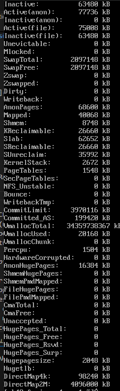
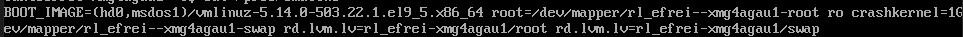
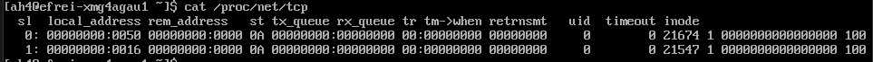
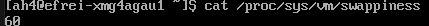

# Part I : A bit of exploration

Commençons par un peu d'exploration manuelle des pseudo-filesystems que sont `/proc` et `/sys`.

⚠️⚠️⚠️ **Vous n'utiliserez que les commandes `cat`, `ls` et `cd` (ou commandes similaires comme du `grep` bien sûr) pour réaliser cette partie.**


## Sommaire

- [Part I : A bit of exploration](#part-i--a-bit-of-exploration)
  - [Sommaire](#sommaire)
  - [1. /proc](#1-proc)
  - [2. /sys](#2-sys)

## 1. /proc

🌞 **Afficher...** :

- l'état complet de la mémoire (RAM)
```bash
cat /proc/meminfo
```


- le nombre de coeurs que votre CPU a (uniquement ce nombre)
```bash	
cat /proc/cpuinfo | grep "cpu cores"
```

- le nombre de processus lancés (uniquement ce nombre)
```bash
echo "$(ls /proc | grep -E "^[0-9]+$" | wc -l) - 3" | bc -l
```

- la ligne de commande utilisée pour lancer le kernel actuel
```bash	
cat /proc/cmdline
```


- la liste des connexions TCP actuelles (même si c'est un peu imbuvable avec nos p'tits yeux)
```bash
cat /proc/net/tcp
```


- la valeur actuelle de la *swappiness* (cf le tip ci-dessous)
```bash
cat /proc/sys/vm/swappiness
```



> La `swap` est une partition sur le disque qui va être utilisée automatiquement par l'OS si la mémoire (RAM) s'apprête à être pleine : l'OS va décharger une partie des machins en RAM pour les mettre sur la partition de `swap`. Ca rame de fou dukoo hein, mais ça continue de fonctionner. La *swappiness* détermine le pourcentage de remplissage de la mémoire à partir duquel l'OS va commencer à utiliser la `swap` (à "swapper" comme on dit :d).

## 2. /sys

> N'oubliez jamais les pages du `man`, c'est un très bonne doc souvent. [Là encore pour **sysfs** (`/sys`)](https://man7.org/linux/man-pages/man5/sysfs.5.html).

🌞 **Afficher...** :

- la liste des périphériques de types bloc reconnus par l'OS (genre les disques durs par exemple koa)
```bash
ls /sys/block
```

- la liste des modules kernel qui sont actuellements en cours d'utilisation
```bash
ls /sys/module
```

- la liste des cartes réseau
```bash
ls /sys/class/net
```