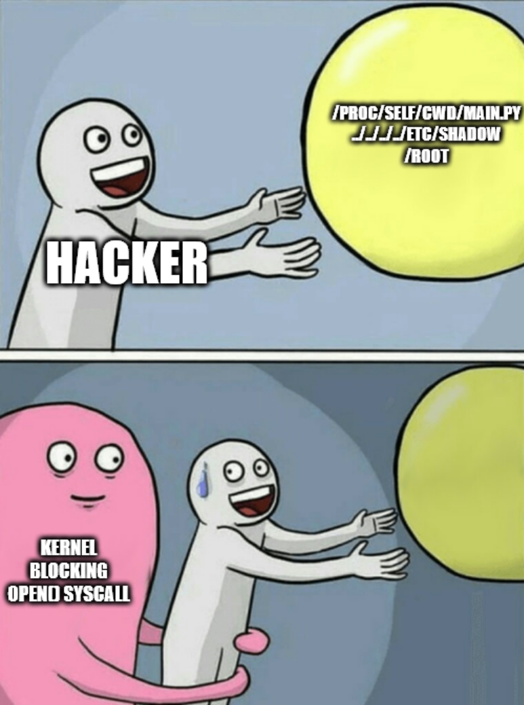

# Part V : Harden me baby

➜ **Une dernière section où on joue encooore avec du *service* systemd.**

Faut dire à un moment que c'est un peu la raison pour laquelle systemd a été adopté par tous les systèmes Linux : il est super bien intégré avec une tonne de mécanismes natifs du système. Et nous on manipule tout ça avec une syntaxe unifiée et simplifiée.

> On parle de définir des *services*, filtrer leur *syscalls*, limiter l'accès aux ressources avec des CGroups, créer des *namespaces* à la volée, un système complexe de dépendances, et bien d'autres encore, juste avec un ptit fichier `.service` et du `clé=valeur`. Nice and easy.

➜ **L'objectif de cette partie : proposer un nouveau `web.service`, la version qui va à la salle.**

Inspirez-vous des précédents fichiers `.service` que vous avez vus/écrits pendant les TPs précédents.

Ce qui doit figurer au minimum dans votre `web.service` :

- lancement en tant qu'**un utilisateur dédié** (vous le créerez au préalable)
- filtrage de **syscalls** au strict minimum
- limitation d'accès aux ressources avec des **restrictions CGroup**
- isolation du processus avec des ***namespaces***
- **utilisation de `chroot`** pour le limiter à un répertoire
- d'autres trucs de votre crû

> Le répertoire dans lequel le programme est chrooté doit contenir au moins un fichier pour qu'on puisse faire des tests de téléchargements (ça reste un ptit serveur web).

Vous vous aiderez de l'outil `systemd-analyze security` ; il est cool ce tool :

- il vous donnera un score (un peu arbitraire) qui représente la sécurité de votre service
- il affiche et recommande l'utilisation de certaines confs dans le `.service`
- il s'utilise en passant an argument le nom de votre service : `systemd-analyze security web.service`

🌞 **Proposez un nouveau fichier `web.service`**

- contient autant de conf que nécessaire pour le rendre le plus secure possible
- par secure on entend le principe du moindre privilège : le processus n'est autorisé à faire que ce qu'il a vraiment besoin de faire dans son fonctionnement légitime
- amusez-vous avec ce que vous recommande `systemd-analyze security`
- le but n'est pas non plus d'avoir le fichier le plus long possible mais toujours de comprendre ce que vous faites et l'impact que ça a !
- **bien sûr l'application doit continuer à fonctionner normalement**

