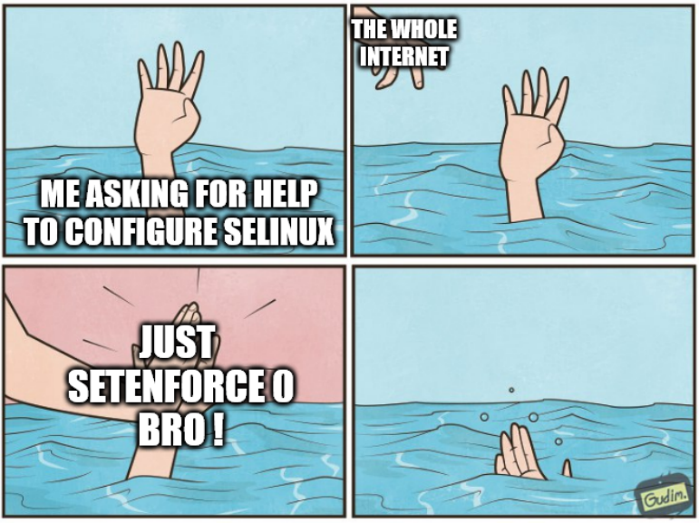
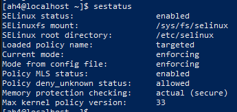
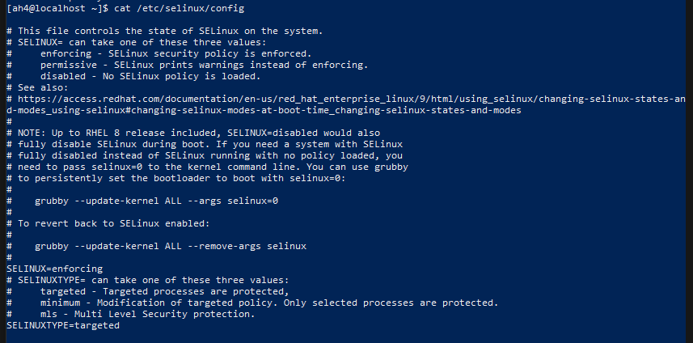

# TP4 : SELinux

**Un mini-TP pour vous présenter SELinux, comprendre à quel endroit il s'insère et essayer de vous faire sentir à quel point le modèle qu'il propose est très granulaire et puissant.**

Cela vient évidemment avec une (gross) charge de configuration supplémentaire : need skillz. SELinux est un modèle complexe, on va se contenter de survoler l'une de ses principales fonctionnalités ici : le *type enforcement*.

C'est le fait que toutes les ressources du système (user, port réseau, fichiers, processus) ont un *type* et que des règles très granulaires définissent quel type a le droit d'interagir avec quel autre type.

> SELinux s'en fout de la nature des entités (il s'en fout qu'un programme essaie d'écouter sur un port, ou un user accès à un fichier) il ne regarde que les *types* et les relations entre *types*.



> `setenforce 0` c'est pour désactiver SELinux évidemment ;)

## Sommaire

- [TP4 : SELinux](#tp4--selinux)
  - [Sommaire](#sommaire)
  - [0. Prérequis](#0-prérequis)
- [Part I : Premiers pas](#part-i--premiers-pas)
  - [0. Intro](#0-intro)
  - [1. Enabling SELinux](#1-enabling-selinux)
  - [2. The Z flag](#2-the-z-flag)
  - [3. Voir les règles définies](#3-voir-les-règles-définies)
- [Part II : Un peu de conf](#part-ii--un-peu-de-conf)
  - [1. Racine web](#1-racine-web)
  - [2. Port](#2-port)
  - [3. Your own policy](#3-your-own-policy)

## 0. Prérequis

➜ **Une seule VM Rocky**

- une seule fera le taff, on se concentre sur le fonctionnement de l'OS en lui-même aujourd'hui encore

🌞 **Installer NGINX**

- ce sera fait ! Ce sera pratique pour nos premiers exemples
- n'oubliez pas d'ouvrir le port firewall
- dans le compte-rendu : un `curl` depuis votre PC pour prouver que le site est dispo
```bash
# sur la VM
$ sudo firewall-cmd --add-port=80/tcp --permanent
$ sudo firewall-cmd --reload

# sur le PC
$ curl http://localhost:8888
```


🌞 **Dans la conf NGINX par défaut**

- y'a une conf pour écouter sur le port 80, et qui sert la page d'accueil par défaut
- mettez en évidence ces lignes (vous cherchez un bloc `server {}`)

```bash
# sur la VM
$ sudo cat /etc/nginx/nginx.conf
```

```nginx
server {
    listen       80 default_server;
    server_name  _;
    root         /usr/share/nginx/html;
    ...
}
```

> Profitez-en pour repérer le chemin où est stocké le site web par défaut, on va s'en servir dans la suite !

# Part I : Premiers pas

## 0. Intro

➜ **SELinux est un module du kernel**

Vous ne verrez pas de processus SELinux s'exécuter, il est **dans** le kernel.

> Un "module", c'est un "plugin" ou un "mod" si vous préférez : un truc qui rajoute des fonctionnalités. En l'occurrence, un module kernel : il rajoute des fonctionnalités au kernel.

➜ **SELinux met en place du contrôle d'accès**

Dès qu'un programme essaie d'interagir avec l'OS (lecture ou écriture d'un fichier, lancer un nouveau programme, utiliser le réseau, etc.), SELinux peut décider si l'action est autorisée ou non.

SELinux s'ajoute à la gestion de contrôle d'accès habituelle (users + groupes + permissions rwx).

➜ **SELinux peut être dans 3 états :**

- **enforcing** : il est activé, il peut bloquer certaines actions, et il log toutes les actions qui enfreignent les règles SELinux définies
- **permissive** : il est activé, mais il log seulement toutes les actions qui enfreignent les règles SELinux définies (il ne bloque rien, il log juste)
- **disabled** : 'lé po activé

➜ **SELinux est un système de labelling**

- on définit un label (un "tag") sur **tous** les fichiers du système : on appelle ça un **contexte SELinux**
  - on peut le voir avec `ls -Z`
- les processus ont aussi un contexte
  - on peut le voir avec `ps -Z`
- on définit un label sur un processus, un label sur un fichier, puis on écrit une règle pour indiquer que le contexte de notre processus est autorisé à interagir avec le contexte du fichier
- il faut donc absolument tout whitelister ! La moindre interaction.

➜ **Ce qui nous intéresse principalement aujourd'hui dans le contexte SELinux, c'est le *type*.**

C'est le troisième champ du contexte SELinux. C'est le truc qui se termine par `_t` par convention. 

C'est par exemple `httpd_sys_content_t` dans `system_u:object_r:httpd_sys_content_t:s0.`

> Pour un processus, le type, SELinux appelle aussi ça un *domain*.

## 1. Enabling SELinux

🌞 **Vérifier l'état actuel de SELinux**

- à votre dispo :
  - la commande `sestatus` affiche l'état actuel de SELinux
  - la commande `setenforce` pour activer ou désactiver temporairement SELinux
  - le fichier de conf : `/etc/selinux/config`
- vérifiez qu'il est bien actuellement activé et qu'il est bloquant
  - il doit être mode **enforcing**
  - PAS EN MODE **permissive**
- vérifiez qu'il est configuré pour être activé dès le démarrage
- vérifiez qu'il est en mode *targeted* (pas le mode *mls* ou autre)
```bash	
$ sestatus
$ cat /etc/selinux/config
```




## 2. The Z flag

➜ Beaucoup de commandes usuelles sont désormais pourvues de l'option `-Z` qui permet d'afficher les labels SELinux.

```bash
# voir les labels sur des fichiers/dossiers/etc.
$ ls -al -Z

# voir les labels sur des users
$ id -Z

# voir les labels des processus en cours d'exécution
$ ps -ef -Z

# voir les labels des ports TCP et UDP en écoute
$ ss -lnptu -Z
```

🌞 **Déterminer le *type* SELinux de...**

- l'utilisateur NGINX
- le fichier de conf de NGINX
- le programme NGINX sur le disque
- le dossier dans lequel se trouve le fichier HTML par défaut
- le fichier HTML par défaut
- le processus NGINX en cours d'exécution
- le port TCP utilisé par NGINX pour écouter

```bash	
# l'utilisateur NGINX
su 
sudo -u nginx id -Z
# unconfined_u:unconfined_r:unconfined_t:s0-s0:c0.c1023

# le fichier de conf de NGINX
ls -al -Z /etc/nginx/nginx.conf
# -rw-r--r--. 1 root root system_u:object_r:httpd_config_t:s0 2334 Nov  8 17:43 /etc/nginx/nginx.conf

# le programme NGINX sur le disque
ls -al -Z /usr/sbin/nginx
# -rwxr-xr-x. 1 root root system_u:object_r:httpd_exec_t:s0 1329232 Nov  8 17:44 /usr/sbin/nginx

# le dossier dans lequel se trouve le fichier HTML par défaut
ls -al -Z /usr/share/nginx/html
-rw-r--r--. 1 root root system_u:object_r:httpd_config_t:s0 2334 Nov  8 17:43 /etc/nginx/nginx.conf
[ah4@localhost ~]$ ls -al -Z /usr/sbin/nginx
-rwxr-xr-x. 1 root root system_u:object_r:httpd_exec_t:s0 1329232 Nov  8 17:44 /usr/sbin/nginx
[ah4@localhost ~]$ ls -al -Z /usr/share/nginx/html
total 12
# drwxr-xr-x. 3 root root system_u:object_r:httpd_sys_content_t:s0  143 Feb 28 15:04 .
# drwxr-xr-x. 4 root root system_u:object_r:usr_t:s0                 33 Feb 28 15:04 ..
# -rw-r--r--. 1 root root system_u:object_r:httpd_sys_content_t:s0 3332 Nov  8 17:41 404.html
# -rw-r--r--. 1 root root system_u:object_r:httpd_sys_content_t:s0 3404 Nov  8 17:41 50x.html
# drwxr-xr-x. 2 root root system_u:object_r:httpd_sys_content_t:s0   27 Feb 28 15:04 icons
# lrwxrwxrwx. 1 root root system_u:object_r:httpd_sys_content_t:s0   25 Nov  8 17:44 index.html -> ../../testpage/index.html
# -rw-r--r--. 1 root root system_u:object_r:httpd_sys_content_t:s0  368 Nov  8 17:41 nginx-logo.png
# lrwxrwxrwx. 1 root root system_u:object_r:httpd_sys_content_t:s0   14 Nov  8 17:44 poweredby.png -> nginx-logo.png
# lrwxrwxrwx. 1 root root system_u:object_r:httpd_sys_content_t:s0   37 Nov  8 17:44 system_noindex_logo.png -> ../../pixmaps/system-noindex-logo.png

# le fichier HTML par défaut
ls -al -Z /usr/share/nginx/html/index.html
# lrwxrwxrwx. 1 root root system_u:object_r:httpd_sys_content_t:s0 25 Nov  8 17:44 /usr/share/nginx/html/index.html -> ../../testpage/index.html

# le processus NGINX en cours d'exécution
ps -efZ | grep nginx
# system_u:system_r:httpd_t:s0    root       11264       1  0 15:16 ?        00:00:00 nginx: master process /usr/sbin/nginx

# le port TCP utilisé par NGINX pour écouter
sudo ss -lnptu | grep nginx
# tcp    LISTEN     0      128    *:80                   *:*                   tcp   LISTEN 0      511          0.0.0.0:80        0.0.0.0:*    users:(("nginx",pid=11268,proc_ctx=system_u:system_r:httpd_t:s0,fd=6),("nginx",pid=11267,proc_ctx=system_u:system_r:httpd_t:s0,fd=6),("nginx",pid=11266,proc_ctx=system_u:system_r:httpd_t:s0,fd=6),("nginx",pid=11265,proc_ctx=system_u:system_r:httpd_t:s0,fd=6),("nginx",pid=11264,proc_ctx=system_u:system_r:httpd_t:s0,fd=6))
# tcp   LISTEN 0      511             [::]:80           [::]:*    users:(("nginx",pid=11268,proc_ctx=system_u:system_r:httpd_t:s0,fd=7),("nginx",pid=11267,proc_ctx=system_u:system_r:httpd_t:s0,fd=7),("nginx",pid=11266,proc_ctx=system_u:system_r:httpd_t:s0,fd=7),("nginx",pid=11265,proc_ctx=system_u:system_r:httpd_t:s0,fd=7),("nginx",pid=11264,proc_ctx=system_u:system_r:httpd_t:s0,fd=7))
```

> Vraiment, on se concentre que sur le *type* : le troisième champ du contexte, qui se termine par `_t` par convention. Le reste d'interférera du contexte pas dans notre TP.

## 3. Voir les règles définies

Pour voir des règles, on utilise généralement `sesearch`.

Utilisation typique :

```bash
sesearch --allow --source un_truc_t --target un_truc_t --class une_classe

# par exedmple
sesearch --allow --source httpd_t --target httpd_t --class file
```

🌞 **Afficher les règles liées à NGINX**

- afficher les règles que le type SELinux du processus NGINX...
- ...a sur le type SELinux du fichier HTML

```bash
sesearch --allow --source httpd_t --target httpd_sys_content_t --class file
```


> Encore une fois, on se concentre essentiellement sur les *types* dans ce TP. Et SELinux s'en fout des fichiers/processus ou quoi, il regarde que les *types*. Donc je vais beaucoup répéter "*type*" dans ce TP oè.

# Part II : Un peu de conf

On va à chaque fois procéder de façon itérative :

- modifier la conf
- redémarrer le service
- constater le *sproutch*
- afficher les logs SELinux
- trouver la ligne de log qui nous dit exactement ce qui a été bloqué

## 1. Racine web

Vous l'avez normalement repéré en intro, NGINX sert une page d'accueil par défaut. Elle est dans `/usr/share/nginx/html` (comme indiqué dans le fichier de conf).

On va déplacer ça dans `/var/www/meow/`.

**C'est un bon prétexte pour voir l'interaction entre un processus et un fichier lorsque SELinux est activé.**

🌞 **Créez-moi tout ça**

- un dossier `/var/www/meow/` qui appartient au user qui lance NGINX
- ontient un fichier `index.html` (contenu de votre choix) qui appartient au user qui lance NGINX
- droits de lecture sur le dossier/le fichier pour le propriétaire

🌞 **Modifier la conf NGINX**

- pour que le site servi sur le port 80 ne soit plus celui de `/usr/share/nginx/html` mais celui qui est dans `/var/www/meow/` (une seule ligne de conf à modifier)
- (re)démarrez le service  `nginx`
- visitez la page web et constater le sproutch (403)


🌞 **Logs !**

- repérez la ligne de log qui montre l'interaction qui a été bloquée
- le fichier de log c'est `/var/log/audit/audit.log`
- vous cherchez une ligne qui contient le mot `avc` (c'est le nom des blocages SELinux)
- et qui contient le *type* du processus `nginx` que vous avez repéré plus tôt

> La ligne doit explicitement mentionner un blocage pour la lecture d'un fichier.

🌞 **Etat des lieux**

- afficher le contexte SELinux de `/usr/share/nginx/html` (oui tu l'as déjà fait, je sais)
- afficher le contexte SELinux de `/var/www/meow`
- constater qu'ils sont différents, et que ça sent le vinaigre

> Il faudrait que notre processus NGINX puisse accéder à ce dossier. Plein de façons de faire : on pourrait par exemple créer un nouveau type `meow_t`, l'attribuer à notre fichier `index.html` et autoriser le *type* du processus NGINX à le lire. On va rien faire de tout ça :D

🌞 **Conf simpliste**

- on va se contenter d'appliquer à notre `/var/www/meow/` la même conf que le dossier de base
- je vous file la commande :

```bash
# copier récursivement les contextes SELinux d'un dossier vers un autre
chcon -R --reference /usr/share/nginx/html /var/www/meow
```

🌞 **Constater le changement**

- votre dossier `/var/www/meow` et son contenu devraient avoir un nouveau contexte SELinux

🌞 **Redémarrez NGINX**

- visitez le site web
- no sproutch ?

## 2. Port

Idem, toujours au même endroit dans la conf, vous l'avez repéré en intro, NGINX écoute par défaut sur le port 80.

On va changer ça pour un autre port non-conventionnel : 8888/tcp.

**C'est un bon prétexte pour voir l'interaction entre un processus et un port TCP lorsque SELinux est activé.**

🌞 **Modifier la conf de NGINX**

- il doit écouter sur le port 8888/tcp
- n'oubliez pas d'ouvrir ce port dans le firewall
- rédémarrez NGINX après avoir modifié la conf
- constater un sproutch immédiat au redémarrages

🌞 **Logs logs logs !**

- repérez la ligne de log qui montre l'interaction qui a été bloquée
- vous cherchez toujours une ligne qui contient le mot `avc` (c'est le nom des blocages SELinux)
- et qui contient le *type* du processus `nginx` que vous avez repéré plus tôt
- et qui mentionne explicitement un blocage sur le port TCP (tcp socket) 8888

➜ **On va procéder différemment pour le port**

- on va continuer à réutiliser la conf existante
- il existe déjà une liste de ports qui portent le type `http_port_t` par défaut
- le type de NGINX a le droit d'écouter sur les ports `http_port_t` par défaut

🌞 **Marquons le port `8888/tcp` avec le type `http_port_t`**

- la commande :

```bash
semanage port -a -t http_port_t -p tcp 8888
```

- prouvez que votre port est bien dans la liste des `http_port_t` avec

```bash
semanage port -l
```

🌞 **Redémarrez NGINX**

- no sproutch ?

## 3. Your own policy

Actuellement, SELinux a une *policy* chargée : un ensemble de règles (des kilotonnes déjà sur une install de base de Rocky) qui détermine ce qui est autorisé pour énormément d'applications qu'on peut installer via les paquets.

C'est modulaire comme truc : on écrit un fichier de conf SELinux par programme, et tout est compilé en une *policy* unique.

Vous pouvez lister les modules chargés dans la policy actuelle avec :

```bash
semodule -l
```

Bon, et on peut nous-mêmes écrire un fichier de règle SELinux, et en faire un module, et l'ajouter à la *policy*. Idéal si on a un super service fait maison, et qu'on souhaite ajouter une policy pour lui !

Genre j'sais pas, UNE CALCULATRICE RESEAU.

➜ **Récupérez la calculatrice réseau**

- le fichier de code + votre `.service`
- avec SELinux activé, le service ne devrait pas démarrer

➜ **Là encore on va rester simple, et utiliser une technique différente**

- quand une action est bloquée, ça produit une ligne de log dans `/var/log/audit.audit.log` qui explique précisément ce qui a été bloqué (on peut utiliser la commande `ausearch` pour chercher facilement avec options cools dans ce fichier)
- on peut générer une conf qui autorise cette action, à partir de la ligne de log, avec la commande `audit2allow`
- je recommande des trucs du genre `sudo ausearch -m AVC -ts recent | tail -n200 | sudo audit2allow -a -m meow` pour générer automatiquement un module pour une policy SELinux :
  - n'affiche que les logs récents
  - récupère les 200 dernières lignes
  - produit la conf avec `audit2allow`
  - le module sera nommé `meow`

> On va pas faire du die&retry : lancer le truc, générer une ligne de nouvelle conf, relancer, ça crash encore, on regénère une ligne, et ainsi de suite. Le mode permissive de SELinux est là pour ça : il génère tous les logs, sans nous bloquer.


🌞 **Passer temporairement SELinux en mode *permissive***

- avec un `sudo setenforce 0`
- vérifier avec un `sestatus`

🌞 **Lancer l'application**

- avec un `sudo systemctl restart calculatrice`
- elle devrait fonctionner

🌞 **Observer les logs**

- vous devriez voir des trucs bloqués en relation avec notre service
- avec un :

```bash
sudo ausearch -m AVC -ts recent | tail -n200
```

🌞 **Observer la conf autogénérée**

- même commande, mais on rajoute `audit2allow`, go faire : 

```bash
sudo ausearch -m AVC -ts recent | tail -n200 | sudo audit2allow -a -m meow
```

🌞 **Stocker la conf générée**

- on redirige le tout dans un fichier qui porte l'extension `.te` par convention
- go :

```bash
# allez dans votre homedir
cd

# générez le fichier de conf pour un nouveau module SELinux
sudo ausearch -m AVC -ts recent | tail -n200 | sudo audit2allow -a -m meow > meow.te
```

🌞 **Appliquer la conf**

- on va compiler ce nouveau module SELinux `meow`
- et on pourra ensuite le charger dans notre policy SELinux actuelle
- suivez le guide :

```bash
# toujours dans le même dossier, avec le fichier meow.te

# on compile le module en un .pp
sudo checkmodule -M -m -o meow.mod meow.te
sudo semodule_package -o meow.pp -m meow.mod

# chargement du module dans notre policy actuelle
# ça peut prendre un peu de temps
sudo semodule -i meow.pp
```

🌞 **Repasser SELinux en mode *enforcing***

- avec un `sudo setenforce 1`
- vérifier avec `sestatus`

🌞 **Redémarrer le service**

- shoud work !

🌞 **Observer le nouveau module chargé**

- lister les modules SELinux en cours de fonctionnement
- et `grep meow` !


